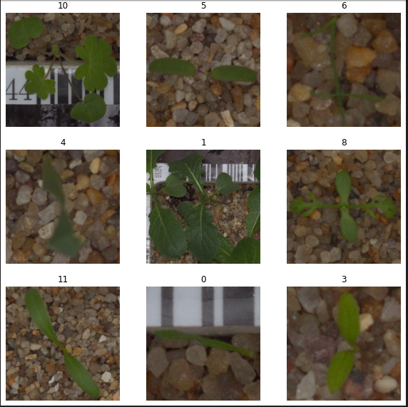

# Plant Seedling Classification
## Image Classification

## Descripction
Build an image classifier which will classify the images of plant seedlings.

 </img>

Dataset is located at: https://vision.eng.au.dk/?download=/data/WeedData/NonsegmentedV2.zip

## Project Structure
### Project 10
1. Assets
2. Datasets
3. Scripts
4. Notebooks
5. Models
6. Deployment

Horacio Morales González

